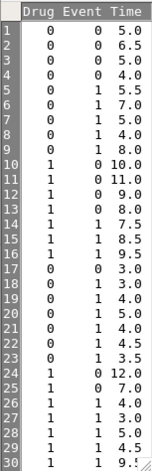

class: middle

<!-- # [資料リンク](https://github.com/winterwang/Epi2020/raw/master/EZRintro/intro.pdf) -->


```{r include=FALSE}
options(digits=3)
```


## 問題

12）新開発されたこの新型ウイルス胃腸炎感染症の検査方法を、地域住民の1000名に対して実施した。この検査の感度は60％、特異度は98％であった。この新型ウイルス胃腸炎の検査前有病率は4％と推定される。

この新しく開発された検査法で陽性と出た時の有病確率を求めよ。

（グラフ法またはEZRで計算せよ）

---
class: midde

## 回答


.small[
- $P(D) = 0.04; P(+ve | D) = 0.60;  P(-ve | \bar{D})=0.98$

$$
\begin{aligned}
P(D | +ve) & = \frac{P(+ve | D) P(D)}{P(D)P(+ve | D) +  [1 - P(D)][1 - P(-ve | \bar{D})] }\\
& = \frac{0.60 \times 0.04}{0.60 \times 0.04 + (1 - 0.04) \times (1 - 0.98) } \\
& = 55.6\% 
\end{aligned}
$$
```{r}
(0.60 * 0.04) / (0.60 * 0.04 + (1 - 0.04) * (1 - 0.98))
```

]

---
class: middle

.small[
```
              Disease positive Disease negative Total
Test positive               24               19    43
Test negative               16              941   957
Total                       40              960  1000

 Point estimates and 95 % CIs:
---------------------------------------------------------
                                    Estimation Lower CI Upper CI
Apparent prevalence                      0.043    0.031    0.057
True prevalence                          0.040    0.029    0.054
Sensitivity                              0.600    0.433    0.751
Specificity                              0.980    0.969    0.988
*Positive predictive value                0.558    0.399    0.709
Negative predictive value                0.983    0.973    0.990
Diagnstic accuracy                       0.965    0.952    0.976
Likelihood ratio of a positive test     30.316   18.167   50.589
Likelihood ratio of a negative test      0.408    0.279    0.597
---------------------------------------------------------
```
]


---
class: middle


.small[
```
              Disease positive Disease negative  Total
Test positive               24             19.2   43.2
Test negative               16            940.8  956.8
Total                       40            960.0 1000.0

 Point estimates and 95 % CIs:
---------------------------------------------------------
                                    Estimation Lower CI Upper CI
Apparent prevalence                      0.043    0.031    0.058
True prevalence                          0.040    0.029    0.054
Sensitivity                              0.600    0.433    0.751
Specificity                              0.980    0.969    0.988
*Positive predictive value                0.556    0.397    0.707
Negative predictive value                0.983    0.973    0.990
Diagnstic accuracy                       0.965    0.951    0.975
Likelihood ratio of a positive test     30.000   18.015   49.959
Likelihood ratio of a negative test      0.408    0.279    0.597
---------------------------------------------------------
```
]


---
background-image: url("fig/Tree.png")
background-position: 50% 50%
background-size: cover


---
class: middle


## 問題


.pull-left[.med[
13）この新型ウイルスの新しい治療法を検証するために、30名の患者にランダム化比較試験へ参加してもらい、回復して退院できるまでの時間（週）を記録した。]
]

.pull-right[.small[
```{r echo=FALSE, message=FALSE}
library(readr)
Drug <- read_csv("data/Drug.csv")

```
]]


---
class: middle

退院できるまでの生存曲線をEZRで比較して違いはあるかを検定するとき

- 新薬投与群と既存薬治療群の退院までの時間それぞれの中央値を計算せよ
- 作成したカプランマイヤー生存曲線図をPDFファイルで提出せよ

```{r echo=FALSE}
library(survival)
su_obj <- Surv(Drug$Time, Drug$Event == 1)
surv <- with(Drug, survfit(su_obj ~ Drug))
# summary(surv)
# surv
```

```
       n median survival 95% CI p.value
Drug=0 16             5.0    4-7  0.0103
Drug=1 14             9.5 4.5-NA   
```


---
background-image: url("fig/KM.png")
background-position: 50% 50%
background-size: contain


---
class: middle

## 生存確率表

```{r eval=FALSE, echo=FALSE}
summary(surv)
```

.small[
```
                Drug=0 
 time n.risk n.event survival std.err lower 95% CI upper 95% CI
  3.0     16       1    0.938  0.0605       0.8261        1.000
  3.5     14       1    0.871  0.0856       0.7180        1.000
  4.0     13       3    0.670  0.1212       0.4697        0.955
  4.5      9       1    0.595  0.1285       0.3898        0.909
  5.0      8       2    0.446  0.1327       0.2494        0.799
  5.5      4       1    0.335  0.1387       0.1487        0.754
  7.0      2       1    0.167  0.1372       0.0336        0.834
  8.0      1       1    0.000     NaN           NA           NA
                Drug=1 
 time n.risk n.event survival std.err lower 95% CI upper 95% CI
  3.0     14       1    0.929  0.0688        0.803        1.000
  4.0     13       1    0.857  0.0935        0.692        1.000
  4.5     12       1    0.786  0.1097        0.598        1.000
  5.0     11       1    0.714  0.1207        0.513        0.995
  7.5      9       1    0.635  0.1308        0.424        0.951
  8.5      7       1    0.544  0.1401        0.329        0.901
  9.5      5       2    0.327  0.1459        0.136        0.784
```
]


---
background-image: url("fig/KMfancy.png")
background-position: 50% 50%
background-size: contain


```{r, echo=FALSE, warning=FALSE, eval=FALSE}
library(survival)
library(ggplot2)
library(survminer)
library(cowplot)
library(ggsci)
ggsurv_age <- ggsurvplot(surv, censor = T, xlab = "Time in Weeks", 
                         conf.int = T,
                         conf.int.style = "step",  # customize style of confidence intervals
                         surv.median.line = "none", ylab = "Survival probability",
                         legend.labs = c("Drug = 0", "Drug = 1"),
                         ggtheme = theme_bw(),  palette = "npg",
                         pval = TRUE, data = Drug,#, pval.method = TRUE
                         risk.table = T,
                         break.time.by = 1,
                         # risk.tables.y.text.col = TRUE, # colour risk table text annotations.
                         # risk.table.y.text = TRUE ,
                         risk.table.col = "strata",
                         risk.table.y.text = FALSE) 

ggsurv_age$plot <- ggsurv_age$plot +  labs(
  title    = "Survival curves",
  subtitle = "Based on Kaplan-Meier estimates"#,
  # caption  = "created with survminer"
)

ggsurv_age <- ggpar(
  ggsurv_age,
  font.title    = c(15, "bold", "black"),
  font.subtitle = c(14, "bold.italic", "black"),
  font.caption  = c(14, "plain", "orange"),
  font.x        = c(14, "bold", "black"),
  font.y        = c(14, "bold", "black"),
  font.xtickslab = c(14, "bold", "black"),
  font.ytickslab = c(14, "bold"),
  legend = "bottom",
  font.legend  = c(13, "bold", "black"),
  legend.title = ""
)
ggsurv_age
```

